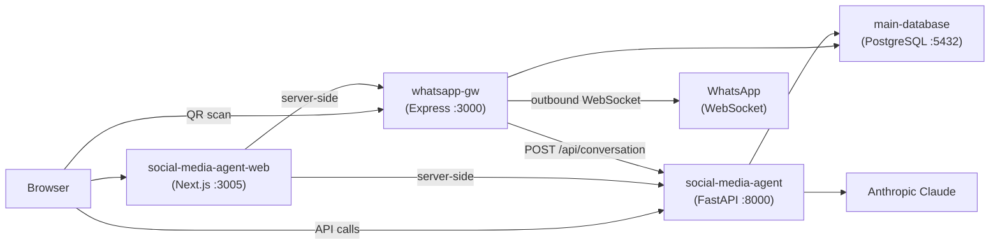

# Social Media Agent — Deployment


Deployment orchestration for the Social Media Agent platform — a multi-service stack that enables non-profit administrators to compose and distribute formal communications via WhatsApp.

---

**[Architecture](#architecture)** · **[Services](#services)** · **[Configuration](#configuration)** · **[Getting Started](#getting-started)** · **[Deployment (AWS)](#deployment-aws)** · **[CI/CD](#cicd)** · **[Database](#database)** · **[Project Structure](#project-structure)**

---

This repository contains the Docker Compose stack, environment configuration, database initialization scripts, and CI/CD workflows that tie together the three application services. Each service is built and published independently via GitHub Actions; this repo pulls the pre-built images from GitHub Container Registry (GHCR) and runs them as a coordinated stack.

## Architecture



### Service communication

- **Internal (Docker network):** Services communicate by container name (`http://whatsapp-gw:3000`, `http://social-media-agent:8000`). No security group rules needed.
- **External (browser):** The web app runs in the user's browser, which connects directly to the WhatsApp gateway (for QR code) and the main service (for API calls) via the host's public IP.

## Services

| Service | Image | Port | Description |
|---------|-------|------|-------------|
| **main-database** | `postgres:16-alpine` | 5432 | PostgreSQL database — users, recipients, distribution lists, message outbox |
| **whatsapp-gw** | `ghcr.io/em-hache/whatsapp-gw` | 3000, 3001 | WhatsApp Web gateway — bridges WhatsApp messaging with the platform |
| **social-media-agent** | `ghcr.io/em-hache/social-media-agent` | 8000 | AI-powered backend — conversation flow, message crafting, approval workflow |
| **social-media-agent-web** | `ghcr.io/em-hache/social-media-agent-web` | 3005 | Admin dashboard — recipient management, distribution lists, message monitoring |

### Dependency order

```
main-database (healthy) → whatsapp-gw → social-media-agent-web
main-database (healthy) → social-media-agent → social-media-agent-web
```

All services have health checks and restart automatically (`unless-stopped`).

## Configuration

Configuration is split into environment-specific files (committed) and secrets (not committed):

```
envs/
├── .env.local       # Local development — URLs point to localhost
├── .env.prod        # Production — URLs point to EC2 public IP
└── .secrets.env     # Secrets (gitignored) — API keys, passwords
```

### Environment files (`.env.local` / `.env.prod`)

| Variable | Description | Local | Production |
|----------|-------------|-------|------------|
| `GITHUB_ORG` | GitHub org owning GHCR packages | `em-hache` | `em-hache` |
| `WH_GW_IMAGE` | WhatsApp gateway image name | `whatsapp-gw` | `whatsapp-gw` |
| `WH_GW_TAG` | Image tag | `latest` | `latest` |
| `AGENT_IMAGE` | Main service image name | `social-media-agent` | `social-media-agent` |
| `AGENT_TAG` | Image tag | `latest` | `latest` |
| `AGENT_WEB_IMAGE` | Web frontend image name | `social-media-agent-web` | `social-media-agent-web` |
| `AGENT_WEB_TAG` | Image tag | `latest` | `latest` |
| `POSTGRES_URL` | Async PostgreSQL connection string | `...@main-database:5432/appdb` | `...@<RDS_ENDPOINT>:5432/<db>` |
| `DB_HOST` | WhatsApp GW database host | `main-database` | `<RDS_ENDPOINT>` |
| `DB_NAME` | WhatsApp GW database name | `appdb` | `social_media_agent` |
| `DB_USER` | WhatsApp GW database user | `whatsapp_gw` | `postgres` |
| `DB_PASSWORD` | WhatsApp GW database password | `whatsapp_gw_secret` | (RDS password) |
| `DB_SSL` | Enable SSL for DB connection | `false` | `true` |
| `WHATSAPP_GW_URL` | Internal gateway URL (Docker) | `http://whatsapp-gw:3000` | `http://whatsapp-gw:3000` |
| `MAIN_SERVICE_URL` | Internal agent URL (Docker) | `http://social-media-agent:8000` | `http://social-media-agent:8000` |
| `NEXT_PUBLIC_WHATSAPP_GW_URL` | Browser-accessible gateway URL | `http://localhost:3000` | `http://<EC2_IP>:3000` |
| `NEXT_PUBLIC_MAIN_SERVICE` | Browser-accessible agent URL | `http://localhost:8000` | `http://<EC2_IP>:8000` |
| `NEXTAUTH_URL` | NextAuth callback URL | `http://localhost:3005` | `http://<EC2_IP>:3005` |
| `DYNAMODB_ARCHIVE_ENABLED` | Enable DynamoDB session archive | `false` | `true` |
| `DYNAMODB_TABLE_NAME` | DynamoDB table name | `session_archive` | `session_archive` |
| `DYNAMODB_REGION` | AWS region for DynamoDB | `eu-west-3` | `eu-west-3` |
| `SESSION_STORE` | Session storage backend | `memory` | `memory` |
| `LOG_LEVEL` | Application log level | `INFO` | `INFO` |

### Secrets file (`.secrets.env`)

This file is **gitignored** and must be created manually on each machine:

| Variable | Description |
|----------|-------------|
| `ANTHROPIC_API_KEY` | Anthropic API key for Claude |
| `AWS_ACCESS_KEY_ID` | AWS credentials (for DynamoDB / RDS) |
| `AWS_SECRET_ACCESS_KEY` | AWS secret key |
| `NEXTAUTH_SECRET` | Random string for NextAuth session encryption |
| `ADMIN_EMAIL` | Default admin email |
| `ADMIN_PASSWORD` | Default admin password |

### How configuration is loaded

The `--env-file` flag passed to `docker compose` controls which environment file is used for variable substitution in `docker-compose.yml`. Secrets are injected directly into containers via the `env_file:` directive in the compose file.

```
docker compose --env-file envs/.env.prod up -d
                    │
                    ▼
    Resolves ${VAR} in docker-compose.yml
    (image tags, public URLs, DB credentials)

    env_file: envs/.secrets.env ──► Injected into container
    (API keys, passwords)
```

## Getting Started

### Prerequisites

- Docker and Docker Compose v2+
- Access to GHCR (GitHub Personal Access Token with `read:packages`)

### Local development

```bash
# 1. Clone the repo
git clone https://github.com/em-hache/social-media-agent-main.git
cd social-media-agent-main

# 2. Create the secrets file
cp envs/.secrets.env.example envs/.secrets.env
# Edit envs/.secrets.env with your API keys and passwords

# 3. Start the stack (--profile local starts the PostgreSQL container)
docker compose --profile local --env-file envs/.env.local up -d

# 4. Verify all services are healthy
docker compose ps
```

The web dashboard will be available at `http://localhost:3005`.

### Useful commands

```bash
# Stop all services
docker compose --profile local down

# Pull latest images and restart
docker compose --profile local --env-file envs/.env.local up -d --pull always

# View logs for a specific service
docker compose logs -f social-media-agent

# Restart a single service
docker compose restart whatsapp-gw
```

## Deployment (AWS)

The production deployment runs on a single EC2 instance using the same Docker Compose stack.

### Infrastructure

| Component | Configuration |
|-----------|--------------|
| **Instance** | m7i-flex.medium (1 vCPU, 4 GB RAM) or t3.small (2 vCPU, 2 GB RAM) |
| **OS** | Amazon Linux 2023 |
| **Storage** | 30 GB gp3 |
| **Region** | eu-west-3 (Paris) |

### Security group

| Type | Port | Source | Purpose |
|------|------|--------|---------|
| SSH | 22 | Your IP | SSH access |
| Custom TCP | 3000 | Your IP | WhatsApp GW (browser QR) |
| Custom TCP | 3005 | Your IP | Web frontend |
| Custom TCP | 8000 | Your IP | FastAPI API / Swagger |

PostgreSQL is hosted on RDS — the EC2 instance connects to it over the private network. No database container runs in production.

### Deployment steps

1. **SSH into the instance:**

```bash
ssh -i ~/.ssh/social-media-agent-key.pem ec2-user@<EC2_PUBLIC_IP>
```

2. **Install Docker:**

```bash
sudo dnf update -y
sudo dnf install -y docker git
sudo systemctl enable docker && sudo systemctl start docker
sudo usermod -aG docker ec2-user

# Install Docker Compose plugin
sudo mkdir -p /usr/local/lib/docker/cli-plugins
sudo curl -SL https://github.com/docker/compose/releases/latest/download/docker-compose-linux-x86_64 \
  -o /usr/local/lib/docker/cli-plugins/docker-compose
sudo chmod +x /usr/local/lib/docker/cli-plugins/docker-compose

# Log out and back in for group changes
exit
```

3. **Authenticate to GHCR:**

```bash
echo "YOUR_GITHUB_PAT" | docker login ghcr.io -u YOUR_GITHUB_USERNAME --password-stdin
```

4. **Clone and configure:**

```bash
git clone https://github.com/em-hache/social-media-agent-main.git
cd social-media-agent-main

# Create the secrets file (not in repo)
nano envs/.secrets.env
```

5. **Start the stack:**

```bash
docker compose --env-file envs/.env.prod up -d --pull always
```

6. **Verify:**

```bash
docker compose ps
```

### Updating the deployment

```bash
cd ~/social-media-agent-main
docker compose --env-file envs/.env.prod down
git pull
docker compose --env-file envs/.env.prod up -d --pull always
```

### Persistence

- **PostgreSQL data** lives in AWS RDS — independent of the EC2 instance lifecycle.
- **DynamoDB sessions** live in AWS DynamoDB — independent of the EC2 instance lifecycle.
- **WhatsApp session** is stored in a named Docker volume (`whatsapp-session`) on the EC2 instance. If the instance is terminated, you'll need to re-scan the QR code.

### Auto-restart on reboot

```bash
# Ensure Docker starts on boot
sudo systemctl enable docker

# Add crontab entry to start compose on reboot
(crontab -l 2>/dev/null; echo "@reboot cd /home/ec2-user/social-media-agent-main && docker compose --env-file envs/.env.prod up -d") | crontab -
```

## CI/CD

Each service has its own GitHub Actions workflow under `.github/workflows/`:

| Workflow | Triggers on | Publishes to |
|----------|-------------|--------------|
| `node-service.yml` | `node-service/**` changes | `ghcr.io/em-hache/whatsapp-gw` |
| `fastapi-service.yml` | `social-media-agent/**` changes | `ghcr.io/em-hache/social-media-agent` |
| `nextjs-app.yml` | `social-media-agent-web/**` changes | `ghcr.io/em-hache/social-media-agent-web` |

All workflows:
1. Build a multi-stage Docker image with GitHub Actions build cache
2. Push to GHCR on every merge to `main`
3. Tag with `latest`, branch name, and short commit SHA (`sha-xxxxxx`)

### Deploying a new version

After CI publishes a new image, SSH into the EC2 instance and run:

```bash
cd ~/social-media-agent-main
docker compose --env-file envs/.env.prod up -d --pull always
```

## Database

### Schema initialization

The database is initialized automatically on first container start via SQL scripts mounted from `main-database/init/`:

| Script | Purpose |
|--------|---------|
| `01_schema.sql` | Creates tables (`users`, `recipients`, `distribution_lists`, `distribution_list_recipients`, `message_outbox`), indexes, and the `whatsapp_gw` database role |
| `02_seed.sql` | Seeds initial test data |

These scripts only run when the PostgreSQL volume is empty (first start). To re-initialize, remove the volume:

```bash
docker compose down -v  # ⚠️ Destroys all data
docker compose --env-file envs/.env.prod up -d
```

### Tables

| Table | Purpose |
|-------|---------|
| `users` | System users with roles (Admin, Manager, Regular) |
| `recipients` | WhatsApp contacts who receive messages |
| `distribution_lists` | Named groups for targeted delivery |
| `distribution_list_recipients` | Many-to-many junction table |
| `message_outbox` | Queued messages with delivery status tracking |

## Project Structure

```
.
├── docker-compose.yml              # Service orchestration
├── envs/
│   ├── .env.local                  # Local environment config
│   ├── .env.prod                   # Production environment config
│   └── .secrets.env                # Secrets (gitignored)
├── main-database/
│   └── init/
│       ├── 01_schema.sql           # Table definitions and indexes
│       └── 02_seed.sql             # Initial seed data
└── .github/
    └── workflows/
        ├── node-service.yml        # CI for WhatsApp gateway
        ├── fastapi-service.yml     # CI for main service
        └── nextjs-app.yml          # CI for web frontend
```